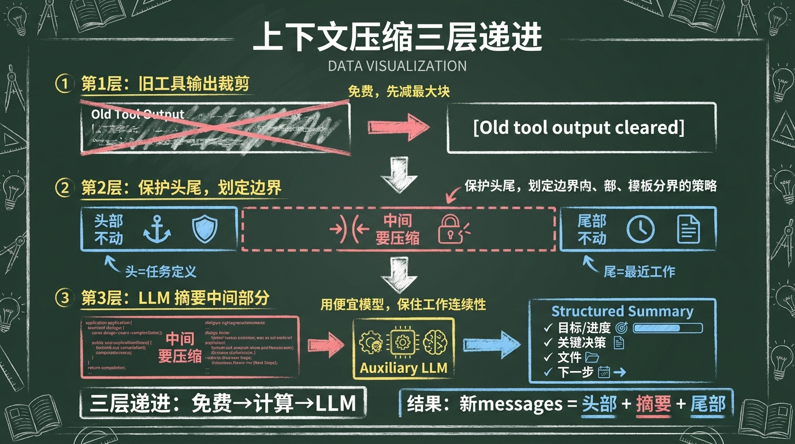
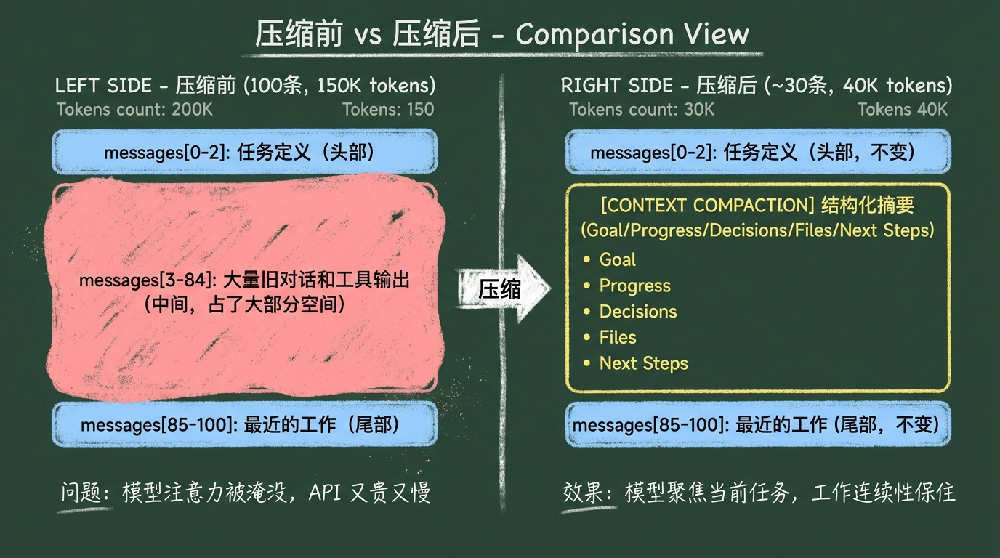

# s05: Context Compression (上下文压缩)

`s00 > s01 > s02 > s03 > s04 > [ s05 ] > s06 > s07 > s08 > s09 > s10 > s11 > s12 > s13 > s14 > s15 > s16 > s17 > s18 > s19 > s20 > s21 > s22 > s23 > s24 > s25 > s26 > s27`

> *上下文不是越多越好，而是要把"仍然有用的部分"留在活跃工作面里。*

## 这一章要解决什么问题

到了 `s04`，agent 已经会调工具、持久化会话、组装提示词。

也正因为它会做的事情更多了，上下文会越来越快膨胀：

- 读一个大文件，会塞进很多文本
- 跑一条长命令，会得到大段输出
- 多轮工具调用后，旧结果会越来越多

如果没有压缩机制，很快就会出现这些问题：

1. 模型注意力被旧结果淹没
2. API 请求越来越重，越来越贵
3. 最终直接撞上上下文上限，任务中断

所以这一章真正要解决的是：

**怎样在不丢掉工作连续性的前提下，把活跃上下文重新腾出空间。**

## 先解释几个名词

### 什么是上下文窗口

你可以把上下文窗口理解成：

> 模型这一轮真正能一起看到的输入容量。

它不是无限的。比如 200K tokens。

### 什么是活跃上下文

并不是历史上出现过的所有内容，都必须一直留在窗口里。

活跃上下文更像：

> 当前继续工作时，最值得模型马上看到的那一部分。

### 什么是压缩

这里的压缩，不是 ZIP 压缩文件。

它的意思是：

> 用更短的表示方式，保留继续工作真正需要的信息。

## 最小心智模型



这一章建议你先记三层，不要一上来记完整算法：

```text
第 1 层：旧工具输出先裁剪
  -> 不需要 LLM，纯字符串替换
  -> 把很久以前的工具结果换成占位提示

第 2 层：保护头尾，只压中间
  -> 头部（任务定义）不动
  -> 尾部（最近工作）不动
  -> 只压中间那些已经"用过了"的轮次

第 3 层：用 LLM 把中间部分摘要化
  -> 调一个便宜的辅助模型
  -> 生成结构化摘要替代原文
```

可以画成这样：

```text
messages（100 条，150K tokens）
   |
   +-- 第 1 层：旧 tool 结果 → "[Old tool output cleared]"
   |   （不需要 LLM，先减掉一批 token）
   |
   +-- 还是太长？
   |
   +-- 第 2 层：找边界
   |   头部：前 N 条（不动）
   |   尾部：最近 ~20K tokens（不动）
   |   中间：要被压缩的部分
   |
   +-- 第 3 层：中间部分 → 辅助 LLM → 结构化摘要
   |
   v
新 messages = [头部] + [摘要] + [尾部]
```

这三层是递进的：第 1 层最便宜（不花钱），第 2 层是边界计算，第 3 层才真正调 LLM。



## 压缩后，真正要保住什么

这是这章最容易讲虚的地方。

压缩不是"把历史缩短"这么简单。真正重要的是：

**让模型还能继续接着干活。**

所以一份合格的摘要，至少要保住这些东西：

1. 当前任务的目标是什么
2. 已经完成了哪些关键动作
3. 做过哪些重要决定
4. 改过或重点查看过哪些文件
5. 下一步应该做什么

如果这些没有保住，那压缩虽然腾出了空间，却打断了工作连续性。

Hermes Agent 用结构化摘要模板来确保这些信息不丢：

```text
## Goal
...
## Progress
...
## Key Decisions
...
## Files Modified
...
## Next Steps
...
```

不是自由文本，而是有格式的。这让模型更容易从摘要中提取关键信息。

## 关键数据结构

### 1. 工具输出占位符

旧的 tool 消息的 content 被替换成：

```text
[Old tool output cleared to save context space]
```

这是第 1 层。不需要 LLM，纯字符串替换，但能先减掉大量 token（工具输出通常很长）。

### 2. 压缩边界

```python
{
    "head_end": 3,        # 前 3 条不动
    "tail_start": 85,     # 第 85 条开始是尾部，不动
    "middle": [3:85],     # 中间这些要被压缩
}
```

尾部不是固定"最后 N 条"，而是按 token 预算计算（约 20K tokens）。这样不管最近的消息长短，保留的信息量相对稳定。

### 3. 压缩后的摘要消息

```python
{
    "role": "assistant",
    "content": "[CONTEXT COMPACTION - system-generated summary of earlier "
               "turns, not a new instruction]\n\n"
               "## Goal\n...\n## Progress\n...\n## Key Decisions\n..."
}
```

中间的几十条消息被这一条摘要替代。

注意 `role` 用 `assistant` 而不是 `user`：`user` role 会被模型理解为「用户的新一轮发言」，触发重新规划，反而让 agent 重复已经做过的工作。`assistant` role 配合明确的 `[CONTEXT COMPACTION - system-generated]` 前缀，是更稳的方案。

## 最小实现

### 第一步：旧工具输出先裁剪

```python
def prune_old_tool_results(messages, keep_recent=3):
    tool_indices = [i for i, m in enumerate(messages) if m.get("role") == "tool"]
    for idx in tool_indices[:-keep_recent]:
        messages[idx] = {**messages[idx], "content": "[Old tool output cleared]"}
    return messages
```

这一步的关键思想是：

> 工具输出通常很长，但对后续工作来说只需要知道"调了什么、大致结果是什么"。不需要 LLM，先把最容易减的减掉。

### 第二步：找到压缩边界

```python
def find_boundaries(messages, protect_first, tail_token_budget):
    head_end = protect_first
    
    # 从后往前数，累计到 tail_token_budget
    tail_start = len(messages)
    tail_tokens = 0
    for i in range(len(messages) - 1, head_end - 1, -1):
        msg_tokens = len(str(messages[i].get("content", ""))) // 4
        if tail_tokens + msg_tokens > tail_token_budget:
            break
        tail_tokens += msg_tokens
        tail_start = i
    
    return head_end, tail_start
```

这一步的关键思想是：

> 保护头（任务定义）和保护尾（最近工作），只压中间。

### 第三步：用辅助 LLM 做摘要

```python
def summarize_middle(turns, previous_summary=None):
    prompt = "Summarize these conversation turns.\n"
    prompt += "Use sections: Goal, Progress, Key Decisions, Files Modified, Next Steps.\n\n"
    
    if previous_summary:
        prompt += f"Previous summary to update:\n{previous_summary}\n\n"
    
    for msg in turns:
        prompt += f"[{msg['role']}] {str(msg.get('content', ''))[:500]}\n"
    
    return call_auxiliary_llm(prompt)  # 用便宜的模型，不用主模型
```

两个要点：

1. **用辅助模型**（便宜、快），不用主模型。压缩是系统操作，不该花贵模型的预算。
2. **如果之前已经压缩过，传入旧摘要**。新摘要变成"更新旧摘要"而不是"从零写一份"，信息损失更小。

### 第四步：组装

```python
def compress(messages, protect_first, tail_token_budget):
    messages = prune_old_tool_results(messages)
    head_end, tail_start = find_boundaries(messages, protect_first, tail_token_budget)
    
    middle = messages[head_end:tail_start]
    summary = summarize_middle(middle)
    
    return (
        messages[:head_end]
        + [{"role": "user", "content": f"[CONTEXT COMPACTION]\n{summary}"}]
        + messages[tail_start:]
    )
```

### 第五步：在主循环里接入

```python
# 在 run_conversation() 的循环开头
if estimate_tokens(messages) >= threshold:
    messages = compress(messages, protect_first=3, tail_token_budget=20000)
```

从这一章开始，主循环不再只管"调模型 + 跑工具"。它还多了一个责任：**管理活跃上下文的预算。**

## Hermes Agent 在这里的独特设计

### 1. Preflight 压缩

`run_conversation()` 进入主循环之前就检查 token 数。如果已经超了（比如用户从大窗口模型切到小窗口模型），在第一次 API 调用之前就压缩。

不等到 API 报错再处理。主动防御比被动恢复好。

### 2. 压缩触发 session 分裂

压缩后创建一个新 session，通过 `parent_session_id` 指向旧 session（见 `s03`）。旧 session 的完整历史不删除，通过链条可追溯。

### 3. system prompt 重建

压缩后，缓存的 system prompt 失效（因为记忆可能已经变了），需要重新组装。这是 `s04` prompt 缓存的例外情况。

### 4. 边界对齐避免孤儿 tool_call

`assistant.tool_calls` 和它的 `tool` 响应必须配对——只要把前者留下、后者压进摘要，下一次 API 请求就会被拒。

实现里 `find_boundaries` 在两端都会把候选切点「吸附」到下一个非 `tool` 消息上：

```python
def _align_to_assistant_boundary(messages, index):
    while index < len(messages) and messages[index].get("role") == "tool":
        index += 1
    return index
```

碰到 tool 就往后走，直到找到 assistant 边界。这样切下来的中段始终是若干完整的 `assistant ↔ tool` 配对，怎么压都不会出孤儿。比"压完再扫一遍清孤儿"更彻底：从源头就保证消息流合法。

### 5. 压缩失败要早退，不死磕

极端情况下头部本身就吃掉了大部分预算（比如用户首条消息塞了一整篇文档），compress 找不到可压的中段，再多压几轮也只是空转。`compress` 比较前后 token 估算，如果没降到原值的 90% 以下，抛 `CompressionStuckError`：

```python
class CompressionStuckError(RuntimeError):
    """Compress couldn't meaningfully shrink the message list."""

# in compress():
after = estimate_tokens(new_messages)
if after >= int(before * COMPRESSION_MIN_SHRINK):
    raise CompressionStuckError(before, after)
```

主循环捕获后立即退出当轮，告诉用户「会话已无法压缩，请新开 session」，而不是一直循环到 `MAX_ITERATIONS`。这一点对应 issue #2 中客户报告的「一直压缩、一直循环」现象。

## 仅靠摘要不够：任务态作为不可压缩区

前面三层（裁剪、找边界、摘要）解决的是「让活跃上下文物理变小」。但有一类问题是「再短的摘要也救不了」的——

**模型对当前任务的目标和进度，必须无损可读。**

考虑这个场景（实际上正是 issue #2 客户报告的）：用户说「读取 agents 下的所有文件」。agent 一边 `read_file` 一边把内容塞进上下文。读到第 4~5 个文件就撞上压缩阈值，中间几十条 tool 输出被压成一段摘要：

```text
Goal: 读取 agents 下所有文件
Progress: 已读若干文件
Files Modified: 无
Next Steps: 继续读剩余文件
```

摘要是有损的。它压根没列出「还剩哪些文件」、也容易把「已读 s01, s02」摘成「已读若干文件」。下一轮压缩时，这份摘要又被进一步浓缩，信息熵指数级衰减。模型只能重新规划，甚至**重复读已经读过的文件**——客户感受到的「一直压缩、一直循环」就是这么来的。

### 解法：把任务态搬出消息流

引入一个 `TaskState`：

```python
@dataclass
class TaskState:
    goal: str = ""
    todos: list[dict] = field(default_factory=list)
    # 每个 todo: {"id", "subject", "status": pending|in_progress|completed}
```

它的关键性质：

1. **不进 messages**——压缩算法看不见它，永远不会被裁剪或摘要。
2. **每轮 API 调用前**，把 `task_state.render()` 拼到 system prompt 末尾。模型每一轮都看到完整的目标和 TODO。
3. agent 通过 3 个工具自己维护它：
   - `task_set_goal(goal)`：任务开始时记下目标
   - `todo_write(items)`：列出步骤（自动补 id 和默认 status=pending）
   - `todo_update(id, status)`：每完成一步标记进度

system prompt 里有一段简短引导（`TASK_TOOLS_GUIDANCE`），告诉模型「多步任务先列 TODO 再做」。

### render() 长什么样

```text
# Task State (live, never compressed)

## Goal
读取 agents 下的所有文件

## TODO
[x] (t1) 列出 agents 目录
[x] (t2) 读 s01_agent_loop.py
[~] (t3) 读 s02_tool_system.py
[ ] (t4) 读 s03_session_store.py
...
```

`[x]` / `[~]` / `[ ]` 是 completed / in_progress / pending 的视觉标记。每轮看到这块，模型就知道「下一步是 t4」，而不是回头去消息流里翻摘要。

### 为什么这样能工作

上下文被切成两层：

| 层 | 性质 | 由谁维护 | 压缩处理 |
|---|---|---|---|
| 消息流 | 可有损 | 模型自动产生 | 按预算压缩 |
| 任务态 | 不可损 | agent 显式调工具 | 永远完整 |

摘要还在做它的工作，但它退化为「中段对话的备忘」——告诉模型「这段时间大致发生了什么」——不再承担「连续性关键载体」这种它扛不住的职责。

> 注意：TaskState 与 `s07` 的 memory 是两回事。memory 是**跨会话**持久化（用户偏好、长期记忆）；TaskState 是**单次任务**内的活跃状态，会话结束即丢。

## 初学者最容易犯的错

### 1. 以为压缩等于删除

不是。更准确地说，是把"不必常驻活跃上下文"的内容换一种表示。旧历史通过 session 链保留。

### 2. 只在撞上限后才临时处理

更好的做法是三层递进：旧输出先裁剪、找边界、再摘要。不是一上来就调 LLM。

### 3. 摘要只写成一句空话

如果摘要没有保住目标、决定、文件、下一步，它对继续工作没有帮助。

### 4. 用主模型做摘要

压缩是系统操作，不是用户请求。用便宜的辅助模型就够了。

### 5. 不保护尾部

把最近的消息也压缩了，agent 立刻忘记刚才在做什么。

### 6. 让摘要承载任务进度

这是 issue #2 真正的根因：把「目标 / 进度 / 待办」这种连续性关键信息托管给摘要器。摘要是有损压缩，多轮下来必丢。

任务态应当由 agent 通过显式工具（`task_set_goal` / `todo_write` / `todo_update`）维护在消息流之外，作为 system prompt 的活区。摘要只承担它能承担的——「中段发生了什么」的备忘。

## 教学边界

这章不要滑成"所有压缩技巧大全"。

教学版只需要讲清四件事：

1. 旧工具输出先裁剪（不花钱）
2. 保护头尾、对齐到 assistant 边界、只压中间
3. 用辅助 LLM 生成结构化摘要，作为「中段备忘」
4. 用 TaskState 把「目标 + 进度」搬出消息流，作为不可压缩的真理来源

刻意停住的：精确 token 计算、多次迭代压缩策略、API 报错触发的被动压缩（→ `s06`）、跨会话持久化（→ `s07`）。

如果读者能做到"对话超过阈值时自动压缩中间部分，头尾不动，摘要保住中段大意，TaskState 保住目标和进度"，这一章就达标了。

## 一句话记住

**上下文压缩的核心不是尽量少字，而是让模型在更短的活跃上下文里，仍然保住继续工作的连续性。**
